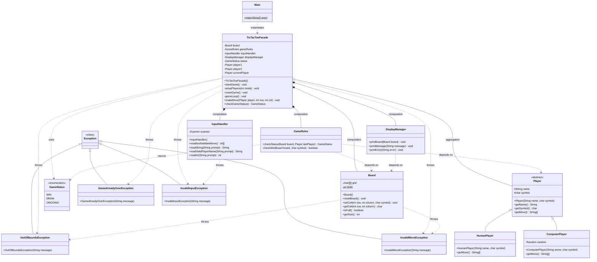

# ❌⭕ Tic Tac Toe (Java CLI)

A fully featured, cleanly architected Tic Tac Toe game played directly from the command line interface. This application was built structurally adhering to the **Facade Design Pattern** to emphasize robust Object-Oriented principles.

## 🌟 Features
- **Two Game Modes:** Choose between Player vs. Player or test your skills against the Computer!
- **Facade Architecture:** Underlying game complexities and sub-systems are securely masked from the client via the central controller (`TicTacToeFacade`).
- **Robust Move Validation:** Handles accidental inputs seamlessly. The input validator tracks moves and requires slots 1-9 natively!
- **Name Filtering:** Requires valid alphabetical user names for maximum display compliance.
- **Bespoke Exception Handling:** Flow disruption is gracefully handled via custom exception handling routines:
    - `InvalidInputException`
    - `InvalidMoveException`
    - `OutOfBoundsException`
    - `GameAlreadyOverException`
- **Zero-Friction Board Scaling:** The grid immediately renders numeric values (1-9) making location tracking extremely easy on the eyes!
- **Automated Replayability:** Finish a brawl and the central Facade easily restarts games!

## 📦 Architecture Rules
This package was built utilizing five separate core foundational blocks behind the `TicTacToeFacade`:
* `Board`: Tracks and updates grid space allocations natively.
* `Player`: Houses user identifiers explicitly. 
* `InputHandler`: Scrapes out CLI input requests, runs Regex validations, captures numeric selections safely.
* `DisplayManager`: Keeps game execution completely separated from string logic / visual presentation blocks. 
* `GameRules`: Mathematical checking loops dynamically built to detect 8 distinct victory lanes as well as draw detections.

## 🚀 Getting Started

### 1. Compile the code
Navigate into the `src` directory containing the application and compile your Java classes:

```bash
cd src
javac com/TicTacToe/Exceptions/*.java com/TicTacToe/Model/*.java com/TicTacToe/Main/Main.java
```

### 2. Run the application
Start the central `Main` client explicitly:
```bash
java com.TicTacToe.Main.Main
```

### 3. Have fun!
Select your mode, enter names using standard alphabetic letters, and choose numbers **1-9** matching the displayed grid locations to drop in your X's and O's!

## 📊 Class Diagram


